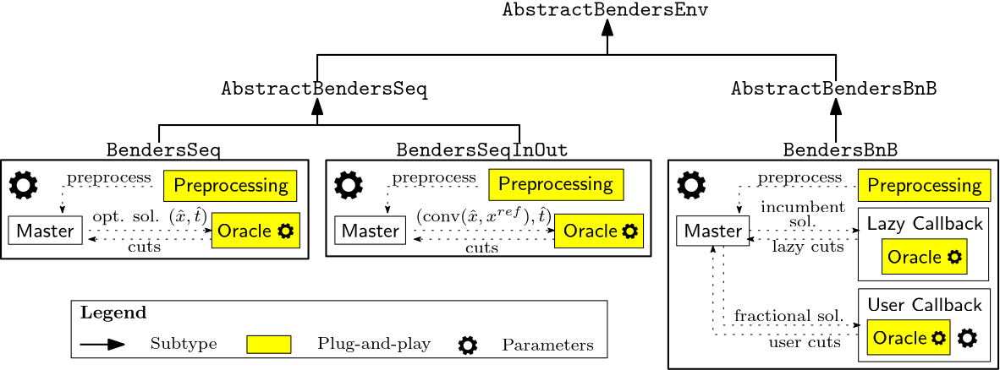
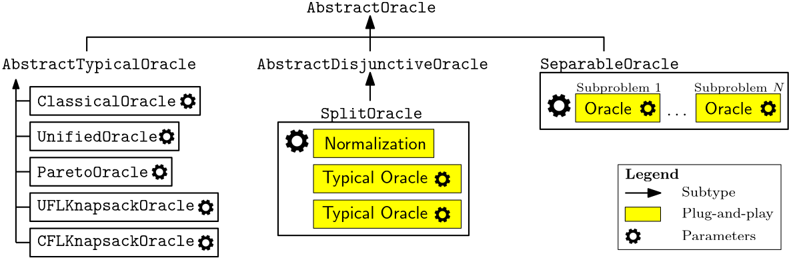
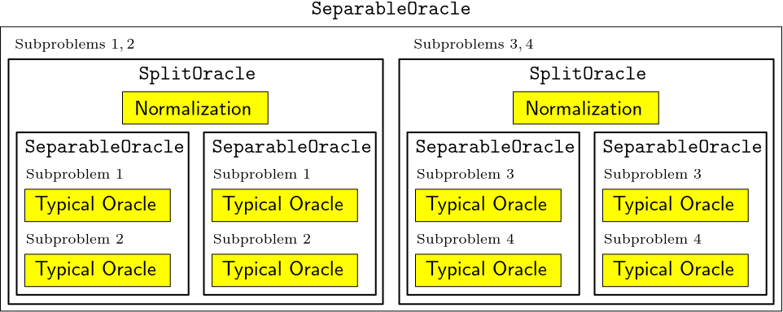

# [User Guide](@id user-guide)

## Master, Oracle, and Environment

BendersX.jl organizes a Benders decomposition algorithm around three core
components: the **Master**, **Oracle**, and **Environment**. Each component has
a distinct responsibility and can be specialized independently.

### Master

The **Master** maintains the current master problem, incorporates generated
Benders cuts, and provides candidate solutions for Oracle evaluation.

Conceptually, the Master:

- represents the current relaxation of the Benders reformulation;
- refines the relaxation by incorporating generated Benders cuts; and
- provides candidate solutions for separation.

In BendersX.jl, a Master is represented by a subtype of `AbstractMaster`.
The provided `Master` implementation is JuMP-based and can be customized at
two levels:

- **Change the master formulation.** Define a new `update_master_model!` method
  while retaining the provided `Master` implementation.
- **Change the master implementation.** Define a new subtype of
  `AbstractMaster` and implement its public interface.

These mechanisms are independent. A new master formulation does not require a new `AbstractMaster` subtype.

### Oracle

An **Oracle** performs candidate separation and generates Benders cuts.

In BendersX.jl, an Oracle:

- is implemented as a subtype of `AbstractOracle`;
- receives candidate linking and auxiliary values;
- determines membership in the set it represents; and
- returns generated cuts and the corresponding subproblem objective values if available.

Oracle behavior can be configured through parameters such as violation
tolerances and cut-selection rules. Oracles can also be composed through
higher-level implementations such as `SeparableOracle` and `SplitOracle`.

### Environment

The **Environment** controls the execution of the Benders algorithm. It
coordinates Master optimization and Oracle evaluation, determines when
generated cuts are incorporated, and manages termination.

In BendersX.jl, an Environment:

- is implemented as a subtype of `AbstractBendersEnv`;
- coordinates the interaction between the Master and Oracle; and
- defines the overall execution strategy.

Environment behavior can be adjusted through parameters and configurable
subcomponents such as preprocessing and callbacks.

--- 

## Component Architecture

The Master, Oracle, and Environment interfaces support both specialization
and composition. The following diagrams summarize the main relationships
among the provided implementations.

### Environments



**Environment architectures.** `BendersSeq`, `BendersSeqInOut`, and
`BendersBnB` differ in how Master optimization, preprocessing, Oracle
evaluation, and callbacks are coordinated. The Oracle remains a replaceable
component of each execution strategy.

### Oracle Implementations



**Oracle implementations and composition.** BendersX provides several typical
Oracle implementations. `SeparableOracle` composes Oracles associated with
different subproblems, allowing each component Oracle to be selected or
specialized independently.

### Oracle Composition



**Oracle composition.** Higher-level Oracles can be constructed by composing
other Oracles. `SplitOracle` combines two typical Oracles together with a
normalization strategy, while the underlying typical Oracles remain
replaceable.

## Adding New Masters

For most problems, users only need to define the master formulation through
`update_master_model!` and use the provided `Master` implementation.

A new `AbstractMaster` subtype is needed only when the master representation
or master-side behavior itself should change. Custom implementations interact
with the rest of BendersX through the `AbstractMaster` public interface:

- `master_model` provides the underlying JuMP model;
- `linking_variables` and `auxiliary_variables` provide the variables used by
  the Benders algorithm;
- `copy_linking_variable_tuple!` provides the structured linking variables
  used to construct subproblem models;
- `evaluate_objective` evaluates the original objective at supplied linking
  and auxiliary values; and
- `add_cuts!` incorporates generated Benders cuts into the master.

A custom Master is therefore free to use its own internal representation. For
example:

```julia
struct MyMaster <: AbstractMaster
    jump_model::JuMP.Model
    linking_vars::Vector{JuMP.VariableRef}
    auxiliary_vars::Vector{JuMP.VariableRef}
    # additional fields
end

BendersX.master_model(master::MyMaster) = master.jump_model
BendersX.linking_variables(master::MyMaster) = master.linking_vars
BendersX.auxiliary_variables(master::MyMaster) = master.auxiliary_vars

# Implement the remaining AbstractMaster interface as required.
```

## Adding New Oracles

A custom separation procedure can be implemented by defining a new
`AbstractOracle` subtype:
```julia
struct MyOracle <: AbstractOracle
    # fields
end
```
and implementing `generate_cuts`:
```julia
function generate_cuts(
    oracle::MyOracle,
    linking_values::Vector{Float64},
    auxiliary_values::Vector{Float64};
    tol_normalize = 1.0,
    time_limit = 3600,
)
    # Generate cuts that separate (x_value, t_value).
    return is_in_L, hyperplanes, sub_obj_vals
end
```
The returned values indicate whether the candidate belongs to the set
represented by the Oracle, the generated `Vector{Hyperplane}`, and the
subproblem objective values corresponding to the represented auxiliary
variables.

Existing Oracles can also be composed. For example, `SeparableOracle` combines
component Oracles representing different subproblems, while `SplitOracle`
constructs disjunctive cuts from two typical Oracles.

## Adding New Environments

A custom execution strategy can be implemented by defining a new
`AbstractBendersEnv` subtype:
```julia
struct MyEnv <: AbstractBendersEnv
    # fields
end
```
and implementing its execution procedure:
```julia
function solve!(env::MyEnv)::DataFrame
    # execution logic
end
```
A custom Environment can reuse existing Master and Oracle implementations
through their public interfaces. This allows execution strategies such as
stabilization, callback-based execution, or distributed coordination to be
introduced without changing the underlying problem formulations or separation
procedures.

---

## Rule of Thumb

- If you are changing the **master formulation**, customize
  `update_master_model!`.
- If you are changing the **master-side behavior**,
  define a new Master implementation.
- If you are changing **how candidates are separated or which cuts are
  generated**, customize the Oracle.
- If you are changing **how Master optimization and separation are
  coordinated**, customize the Environment.
